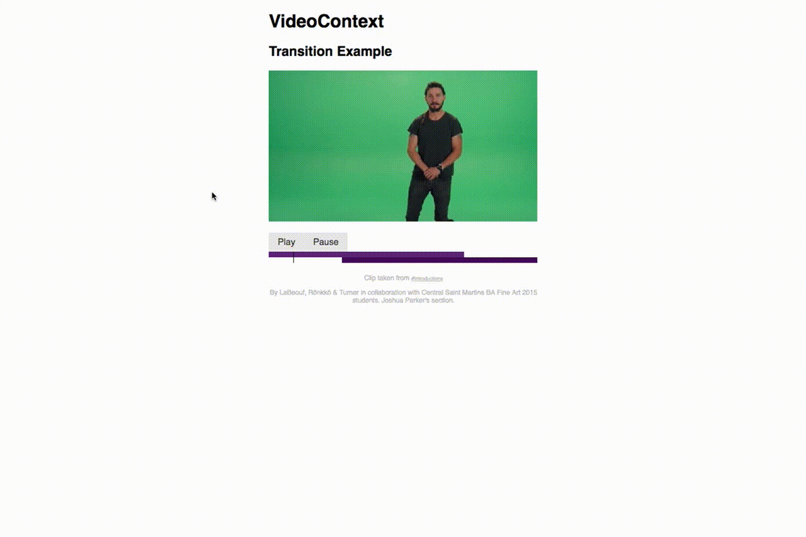

# VideoContext Dev Tools

A handy addition to your Chrome Dev Tools for VideoContext. **Requires VideoContext v0.50+**.



To install it, follow the instructions at <https://bbc.github.io/videocontext-devtools/>. Once the extension is installed, open an app with a running instance of VideoContext (you can find a ready-made one [here](http://bbc.github.io/VideoContext/examples/transitions.html)), open your Chrome DevTools and navigate to the VideoContext DevTools tab.

## Identifying running instances

VideoContext automatically registers instances with the Dev Tools and identifies it with an amusing randomly generated name. If you want to manually specify the name that appears in the Dev Tools, then set the VideoContext ID:

```js
const ctx = new VideoContext(canvas)
ctx.id = "my chosen id"
```

## Developing
This extension is formed of two parts - the frontend (the user-facing UI), and the backend (underlying machinery to allow the dev tools extension to pull data from the DOM about running VideoContext instances).

To develop the frontend, run `yarn start`. This starts a webpack dev server which lets you tweak the frontend (which is backed by a mock data source).
